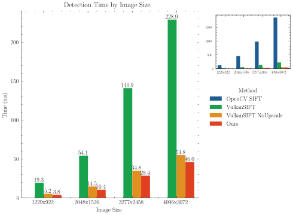
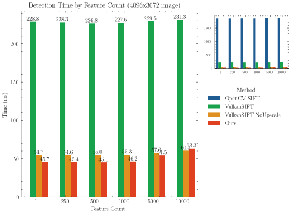
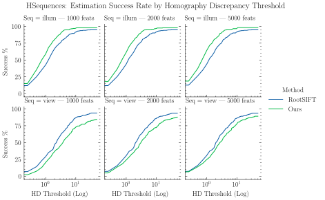

# Fast Local Image Features

Features extracted from 1920x1080 camera feed, matched with [USearch](https://github.com/unum-cloud/USearch) on Ryzen 7840HS Laptop integrated GPU:

https://private-user-images.githubusercontent.com/62287652/505719416-00f015c0-5b40-45fd-b226-d197d2f49aea.mp4

Vulkan-based local image feature detector, combining a DoG variant described by [Ghahremani et al.](https://arxiv.org/abs/2012.00859) and Multi Kernel Descriptors by [Mukundan et al.](https://arxiv.org/abs/1811.11147). To my knowledge, this is the first non-PyTorch implementation of MKD.

Very experimental, tested on: AMD Ryzen 7 RDNA3, Intel 6th and 8th gen, RTX3060.

Project goals:

 - Be very fast.
 - Usable on as much hardware as possible (Raspberry Pi 4/5 would be a goal), no-fuss pip-installable
 - With decent detecting/matching performance

It seems like a lot of research in the past 15 years has not made it into mainstream/accessible libraries and OpenCV SIFT is still
the de facto standard for tinkering and hobbyists messing around. It would be cool to change that! 

### Roadmap

For MKD (the more interesting thing here):

 - Fancy descriptor dimensionality reduction, something like https://arxiv.org/pdf/2209.13586
   - Matryoshka, binary, float8 etc
   - Choice between reproject+truncate only or nicer but slower MLP
 - Dense features, more focus on retrieval tasks
 - Experiment with patch gradient computation. Right now central differences, which loses a lot of high frequencies. Maybe [Robert's Cross](https://bartwronski.com/2021/02/28/computing-gradients-on-grids-forward-central-and-diagonal-differences/)?
 - Need bigger patch dataset, pipeline to create your own
   - Very fancy: ARKitScenes or known camera poses + DepthAnything for patch covisibility/viewpoint ground truth
   - or just ELOFTR/ROMA as reference point correspondences
 - CPU fallback implementation

Optimization:

 - Convolutions can probably be faster, grid search over tile sizes etc.
 - MKD: more difficult. Currently eats lots of registers (50% occupancy on RDNA3), but I have not found any other way that's faster in wall-clock time,
 even if load-stores/registers are reduced. 
 The accumulation over three nested loops (patch pixels, Kronecker products) specifically is quite tricky and unintuitive in terms of performance. 

Other: 
 - Make an actual library: support more hardware, tests, (stable) interface and python bindings
 - Compatibility: Vulkan 1.2 with no extra device features (Raspberry Pi), ideally Vulkan 1.1
 - [LightGlue](https://arxiv.org/pdf/2306.13643.pdf)!
 - Keypoint pruning: the orientation histogram is basically a baby SIFT descriptor, and we have the data to compute e.g., structural tensors. There's got to be
 some useful information in all that.
 - Top-K filtering for features on GPU, right now done on CPU. From my experiments simple histogram/bucketing is the way to go, actual ([multi-pass :/](https://raphlinus.github.io/gpu/2021/11/17/prefix-sum-portable.html) ) sorting/Top-K is not worth it for a few thousand items.

## Benchmarks

#### Speed

Comparison with OpenCV SIFT (CPU), and Maël Aubert's excellent [VulkanSIFT](https://github.com/maelaubert/VulkanSift). 
For SIFT, the initial 2x upscale which is generally accepted as necessary (OpenCV does not even let you disable it) is the biggest performance killer.  
As far as I know, there is no explanation in the literature for why it improves results, sometimes drastically (and details like why you'd want to use linear interpolation for it).

The comparisons here are kind of apples to oranges in more ways than one, but they give a rough idea and show that MKD is orders of magnitude more costly 
to compute compared to the practically free SIFT histograms, so the number of features actually matters quite a lot.

Run on a Ryzen 7840HS laptop, 64GB DDR5 5600MHz, Mesa 25.0.7 RADV.





To run them: 

```
cd benchmarks
cargo bench --features "opencv,vulkansift"

# For the plots:
cargo criterion --features="opencv,vulkansift" --message-format=json --plotting-backend disabled > bench_out.json
uv run python plot.py bench_out.json
``````

#### Quality

This one is very difficult to evaluate, and most metrics bad at predicting performance on real tasks. 
You need to test the actual final task, other results are not generalizable ([Mishkin, 2024](https://cmp.felk.cvut.cz/~mishkdmy/slides/eccv2024_mishkin_imc_history.pdf)). The more comprehensive benchmarks like [COLMAP](https://github.com/ahojnnes/local-feature-evaluation) are unfortunately not simple to run.

Nonetheless, here is a comparison to OpenCV SIFT on [HPatches](https://github.com/hpatches/hpatches-dataset) homography estimation using [homography discrepancy](https://www.mdpi.com/2079-9292/12/24/4977) to measure the error. For both methods, features are matched with NN and Lowe's ratio test and fed into OpenCV USAC_MAGSAC with 5000 iterations.



Just comparing descriptors, MKD is unquestionably superior to SIFT (cf. paper), but in this benchmark the blob detector (Fast Feature Detector, FFD) is the limiting factor.
In a few scenes, FFD just misses a lot of features. There's a lot of finicky tuning to be done, so it can probably be improved. 
SIFT DoG and FFD are built on the same concepts, so there's no a priori reason to expect one to be significantly better or worse than the other across the board.

In the results reported by Ghahremani et al., FFD beats SuperPoint (but then so does BRISK?) which my implementation definitely won't. 
I don't have the expertise to evaluate this, but overall the findings in the paper (beating SuperPoint, D2NET, LIFT and more, 20x faster than SIFT) 
seem a bit out there. 

## Build

Requirements for library (nix devshell also contains everything):

 - Rust
 - Vulkan SDK

*Note for Intel*: you may need to [allow long-running dispatches](https://www.intel.com/content/www/us/en/docs/oneapi/installation-guide-hpc-cluster/2024-0/step-4-set-up-user-permissions-for-using-the.html#ALLOW-LONG-RUNNING-GPU-KERNELS) to run Vulkan compute workloads.

## Examples

### Simple

Extract features from two images and draw matches:

`cargo run --release --bin match_images -- IMAGE1 IMAGE2 IMAGE_OUT`

### Webcam (Linux only)

Requires `video4linux`. 

`cargo run --release --bin webcam`

Pressing space will save the current video frame and extracted features (displayed on the right). Features are then matched between the camera feed and the saved image.

## License

This library is available under the GNU General Public License v3.
